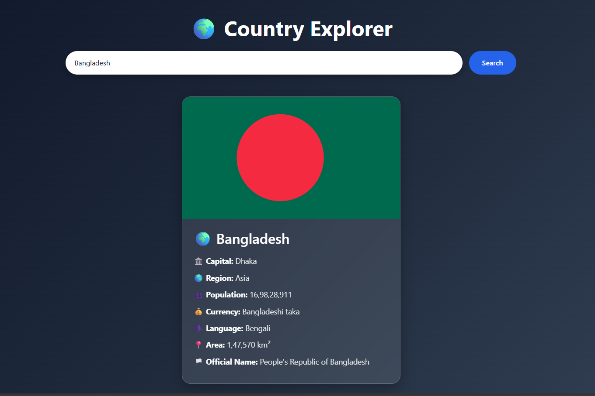

# 🌍 Country Explorer Pro

A modern and responsive Country Explorer web application built using **HTML5, CSS3, JavaScript (ES6+)**, and the **REST Countries API**. Users can search for countries, explore detailed information, filter by region, switch themes, and view recent searches.

---

## 🚀 Live Demo

🔗 https://your-username.github.io/Country-Explorer-API-Integration/

---

## 📂 GitHub Repository

🔗 https://github.com/SACHIN197-creator/Country-Explorer-API-Integration/

---

## ✨ Features

* 🔍 Search countries by name
* 🌎 Filter countries by region
* 📊 Population, Area, Currency & Language Information
* 🏛️ Capital & Official Country Name
* 🌐 Timezone Information
* ⚡ Real-time API Data Fetching
* ⏳ Loading State
* ❌ Error Handling
* 📱 Fully Responsive Design
* 🎨 Glassmorphism UI Design

---

## 🛠️ Technologies Used

* HTML5
* CSS3
* JavaScript (ES6+)
* Bootstrap 5
* REST Countries API

---

## 🌐 API Used

### REST Countries API

https://restcountries.com/

The API provides real-time country information including:

* Country Name
* Flag
* Capital
* Population
* Currency
* Languages
* Area
* Region
* Timezones

Data is fetched dynamically using the JavaScript Fetch API.

---

## 📸 Screenshots

### Home Page


### Home Page



---

## 📁 Folder Structure

```text
Country-Explorer/
│
├── index.html
│
├── css/
│   └── style.css
│
├── js/
│   └── app.js
│
├── images/
│   ├── home1.png
│   ├── home2.png
│   
│
└── README.md
```

---

## 🚀 Run the project:

Open `index.html` in your browser or use VS Code Live Server.


## 🎯 Learning Outcomes

This project helped me learn:

* Working with REST APIs
* Fetch API & Async JavaScript
* Error Handling
* DOM Manipulation
* Local Storage
* Responsive Web Design
* Modern UI Design
* Git & GitHub Workflow
* GitHub Pages Deployment

---


## 👨‍💻 Developer

Sachin Kumar

GitHub: https://github.com/SACHIN197-creator

---
